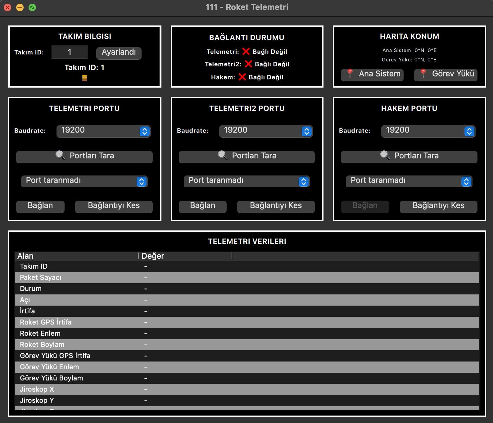

# 111 - Rocket Telemetry Ground Station

A comprehensive ground station application for rocket telemetry data collection, monitoring, and transmission. This application provides real-time monitoring of rocket systems, payload tracking, and communication with judge systems during rocket competitions.



## 🚀 Features

### Core Functionality
- **Multi-Port Telemetry Support**: Simultaneous connection to multiple telemetry sources
- **Real-Time Data Monitoring**: Live display of rocket and payload telemetry data
- **Judge System Integration**: Automatic data transmission to competition judge systems
- **Interactive Map Display**: Real-time GPS tracking with OpenStreetMap integration
- **Cross-Platform Support**: Works on Windows, macOS, and Linux

### Interface Components

#### Team Information Panel
- Team ID configuration and locking mechanism
- Visual status indicators for team setup
- Secure team identification for competition compliance

#### Connection Status Monitoring
- **Telemetry Port**: Main rocket system data connection
- **Telemetry2 Port**: Secondary payload data connection  
- **Judge Port**: Competition judge system communication
- Real-time connection status with visual indicators

#### Map Location Display
- **Main System Coordinates**: Real-time rocket GPS tracking
- **Payload Coordinates**: Separate payload location monitoring
- Interactive map buttons for external map viewing
- Coordinate display with precision formatting

#### Port Configuration Panels
- **Automatic Port Scanning**: Intelligent detection of available COM/USB ports
- **Cross-Platform Port Detection**: Supports Windows (COM ports), macOS/Linux (ttyUSB, ttyACM, cu.usbserial, cu.usbmodem)
- **Real-Time Port Validation**: Tests port accessibility before listing
- **Baud Rate Selection**: Configurable communication speeds (9600-115200)
- **Connection Management**: Connect/disconnect controls for each port
- **Port Status Monitoring**: Live connection status with visual indicators

#### Telemetry Data Table
Comprehensive real-time display of:
- Team ID and packet counter
- System status and angle measurements
- Altitude data (both barometric and GPS)
- GPS coordinates (latitude/longitude)
- Gyroscope readings (X, Y, Z axes)
- Acceleration data (X, Y, Z axes)
- RMS (Root Mean Square) values for payload systems

## 🛠️ Technical Architecture

### Software Stack
- **Frontend**: QML (Qt Modeling Language) for modern, responsive UI
- **Backend**: Python with PyQt5 for robust serial communication
- **Mapping**: Leaflet.js with OpenStreetMap tiles
- **Communication**: Serial port protocols with JSON data parsing

### Data Flow Architecture
1. **Data Collection**: Multiple serial ports receive telemetry data
2. **Data Processing**: JSON parsing and format standardization
3. **Data Integration**: Merging of main system and payload data
4. **Data Display**: Real-time UI updates with formatted values
5. **Data Transmission**: Automatic forwarding to judge systems

### Communication Protocols
- **HYI Protocol**: 78-byte binary packets for judge communication
- **JSON Format**: Human-readable telemetry data from rocket systems
- **Serial Communication**: Configurable baud rates and port settings

## 📋 Prerequisites

- Python 3.7 or higher
- Operating System: Windows 10+, macOS 10.14+, or Linux (Ubuntu 18.04+)
- Serial ports (USB-to-Serial adapters recommended)
- Internet connection for map functionality

## 🚀 Installation

### 1. Clone the Repository
```bash
git clone git@github.com:yunusemrecftci/111.git
cd 111
```

### 2. Create Virtual Environment (Recommended)
```bash
# Create virtual environment
python -m venv venv

# Activate virtual environment
# On Windows:
venv\Scripts\activate
# On macOS/Linux:
source venv/bin/activate
```

### 3. Install Dependencies
```bash
pip install -r requirements.txt
```

### 4. Run the Application
```bash
python main.py
```

## 📖 Usage Guide

### Initial Setup

1. **Launch the Application**
   - Run `python main.py` from the project directory
   - The application will start with the main interface

2. **Configure Team ID**
   - Enter your team ID in the "TAKIM BILGISI" panel
   - Click "Ayarlandı" to lock the team ID
   - ⚠️ **Important**: Team ID must be locked before connecting to judge system

### Port Configuration

1. **Automatic Port Scanning**
   - Click "🔍 Portları Tara" in each port panel
   - System automatically detects and validates available serial ports
   - **Windows**: Scans COM1-COM99 ports and tests accessibility
   - **macOS/Linux**: Scans /dev/ttyUSB*, /dev/ttyACM*, /dev/cu.usbserial*, /dev/cu.usbmodem*
   - Ports are tested for read/write access before being listed
   - Available ports appear in the dropdown with descriptive names

2. **Configure Communication Settings**
   - Select appropriate baud rate (default: 19200)
   - Choose the correct port from the validated dropdown list
   - System shows port status (available, in use, or inaccessible)

3. **Establish Connections**
   - Click "Bağlan" to connect to each telemetry source
   - Monitor connection status in the "BAĞLANTI DURUMU" panel
   - Real-time connection validation and error reporting

### Data Monitoring

1. **Real-Time Telemetry**
   - Connected systems will display live data in the telemetry table
   - Data updates automatically as new packets are received

2. **Map Tracking**
   - GPS coordinates are displayed in the "HARITA KONUM" panel
   - Click map buttons to view locations in external map services

3. **Judge Communication**
   - Data is automatically transmitted to judge systems when connected
   - Transmission frequency is configurable (default: 5Hz)

### Troubleshooting

#### Connection Issues
- **Port Not Found**: 
  - Ensure devices are connected and drivers are installed
  - Use "🔍 Portları Tara" to refresh the port list
  - Check if ports are being used by other applications
- **Permission Denied**: Run with administrator/sudo privileges if needed
- **Baud Rate Mismatch**: Verify baud rate matches your telemetry system
- **Port Scanning Issues**:
  - **Windows**: Check Device Manager for COM port assignments
  - **macOS**: Verify USB-to-Serial drivers are installed
  - **Linux**: Ensure user is in the `dialout` group: `sudo usermod -a -G dialout $USER`

#### Data Display Issues
- **No Data Received**: Check serial connections and data format
- **Incorrect Values**: Verify JSON format matches expected structure
- **Map Not Updating**: Ensure GPS coordinates are being received

## 🔧 Configuration

### Telemetry Data Formats

#### Main System Format (Anakart)
```json
{
  "alt": 150.5,
  "gpsAlt": 152.3,
  "lat": 39.9334,
  "lng": 32.8597,
  "eulX": 0.1,
  "eulY": -0.2,
  "eulZ": 0.0,
  "pitch": 15.5,
  "accX": 0.1,
  "accY": 0.0,
  "accZ": 9.8,
  "state": 1
}
```

#### Payload Format (Görev Yükü)
```json
{
  "header": 82,
  "lat": 39.9500,
  "lng": 32.8700,
  "alt": 155.2,
  "rms_internal": 0.0020,
  "rms_external": 0.0000
}
```

### Judge Communication Protocol

The application automatically creates HYI protocol packets (78 bytes) containing:
- Team ID and packet counter
- Combined telemetry data from all sources
- GPS coordinates and altitude information
- Sensor readings (gyroscope, accelerometer)
- System status and angle data

#### HYI Judge Packet Structure (78 bytes)
```
Byte 0-1:   0xFF 0xFF (Header)
Byte 2-3:   0x54 0x52 (Protocol ID)
Byte 4:     Team ID (UINT8)
Byte 5:     Packet Counter (UINT8)
Byte 6-9:   Altitude (FLOAT32)
Byte 10-13: Rocket GPS Altitude (FLOAT32)
Byte 14-17: Rocket Latitude (FLOAT32)
Byte 18-21: Rocket Longitude (FLOAT32)
Byte 22-25: Payload GPS Altitude (FLOAT32)
Byte 26-29: Payload Latitude (FLOAT32)
Byte 30-33: Payload Longitude (FLOAT32)
Byte 34-37: Stage GPS Altitude (FLOAT32)
Byte 38-41: Stage Latitude (FLOAT32)
Byte 42-45: Stage Longitude (FLOAT32)
Byte 46-49: Gyroscope X (FLOAT32)
Byte 50-53: Gyroscope Y (FLOAT32)
Byte 54-57: Gyroscope Z (FLOAT32)
Byte 58-61: Acceleration X (FLOAT32)
Byte 62-65: Acceleration Y (FLOAT32)
Byte 66-69: Acceleration Z (FLOAT32)
Byte 70-73: Angle (FLOAT32)
Byte 74:    Status (UINT8)
Byte 75:    Checksum (UINT8)
Byte 76-77: 0x0D 0x0A (Footer)
```

#### Incoming Telemetry Packet Structures

##### Main System Packet (Anakart)
```json
{
  "alt": 150.5,           // Barometric altitude (meters)
  "gpsAlt": 152.3,        // GPS altitude (meters)
  "lat": 39.9334,         // Latitude (degrees)
  "lng": 32.8597,         // Longitude (degrees)
  "eulX": 0.1,            // Euler angle X (degrees)
  "eulY": -0.2,           // Euler angle Y (degrees)
  "eulZ": 0.0,            // Euler angle Z (degrees)
  "pitch": 15.5,          // Pitch angle (degrees)
  "accX": 0.1,            // Acceleration X (m/s²)
  "accY": 0.0,            // Acceleration Y (m/s²)
  "accZ": 9.8,            // Acceleration Z (m/s²)
  "state": 1              // System status (0-255)
}
```

##### Payload Packet (Görev Yükü)
```json
{
  "header": 82,           // Packet header identifier
  "lat": 39.9500,         // Payload latitude (degrees)
  "lng": 32.8700,         // Payload longitude (degrees)
  "alt": 155.2,           // Payload altitude (meters)
  "rms_internal": 0.0020, // Internal RMS value
  "rms_external": 0.0000  // External RMS value
}
```

#### Packet Processing Flow
1. **Reception**: Serial ports receive JSON packets
2. **Validation**: JSON structure validation and error handling
3. **Parsing**: Data extraction and type conversion
4. **Integration**: Merging with existing telemetry data
5. **Transmission**: HYI packet generation for judge system
6. **Display**: Real-time UI updates

## 🏗️ Code Structure

### Main Components

#### `main.py`
- **SerialManager Class**: Core telemetry management and communication
- **QML Integration**: UI framework and user interaction handling
- **Data Processing**: JSON parsing and HYI packet generation
- **Port Management**: Serial port scanning and connection handling

#### Key Methods
- `scan_ports()`: **Intelligent automatic serial port detection and validation**
  - Cross-platform port scanning (Windows COM ports, macOS/Linux tty devices)
  - Real-time port accessibility testing
  - Automatic filtering of valid serial communication ports
  - Descriptive port naming with device information
- `parse_telemetry_packet()`: JSON data processing and validation
- `create_hyi_packet()`: Judge communication protocol implementation
- `_send_combined_data_to_judge()`: Automated data transmission

#### `map.html`
- Interactive map display using Leaflet.js
- Real-time marker updates for rocket and payload positions
- OpenStreetMap integration for detailed geographical data

### Data Flow
1. **Serial Ports** → Raw telemetry data reception
2. **JSON Parser** → Structured data extraction
3. **Data Merger** → Combined telemetry processing
4. **UI Updates** → Real-time display refresh
5. **Judge Transmission** → Competition data forwarding

## 🤝 Contributing

1. Fork the repository
2. Create a feature branch (`git checkout -b feature/amazing-feature`)
3. Commit your changes (`git commit -m 'Add amazing feature'`)
4. Push to the branch (`git push origin feature/amazing-feature`)
5. Open a Pull Request

## 📄 License

This project is licensed under the MIT License - see the [LICENSE](LICENSE) file for details.

## 🆘 Support

For support and questions:
- Create an issue in the GitHub repository
- Check the troubleshooting section above
- Review the technical documentation

## 🎯 Competition Usage

This ground station is **tested and validated** for rocket competition environments:
- **✅ Competition Tested**: System has been tested in real competition conditions
- **✅ Judge System Compatible**: Validated HYI protocol implementation
- **✅ Multi-Team Ready**: Secure team identification and data isolation
- **✅ Real-Time Performance**: Optimized for live competition monitoring
- **✅ Cross-Platform Reliability**: Tested on Windows, macOS, and Linux

### Competition Features
- **Team Identification**: Secure team ID management with locking mechanism
- **Judge Integration**: Automatic competition data transmission (5Hz default)
- **Real-Time Monitoring**: Live telemetry during flight operations
- **Data Logging**: Comprehensive flight data collection and storage
- **Multi-System Support**: Handles complex rocket architectures
- **Port Management**: Automatic detection and connection of telemetry sources
- **Error Handling**: Robust error recovery for competition environments

---

**✅ Competition Ready**: This application has been tested and validated for rocket competition environments. The system is ready for immediate use in rocket competitions with proper hardware configuration.
